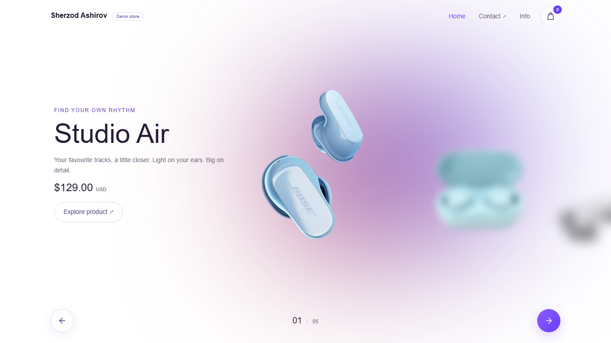
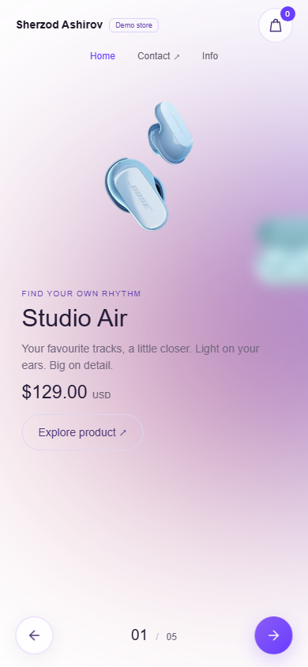

# Headphones — an interactive shopping demo

A headphone storefront built by **Sherzod Ashirov** with HTML, CSS and JavaScript. Explore a collection, build a shopping bag and complete a simulated order, all in the browser.

[Open the live demo](https://ashirovsherzod.github.io/Headphones-Ecommerce/) · [Meet the creator](https://github.com/AshirovSherzod)



## The experience

- Five concept products with individual descriptions, sample prices and specifications.
- A full viewport carousel with an ambient background, arrow controls, keyboard navigation and horizontal touch gestures.
- A persistent shopping bag with quantities, removal, totals, empty states and an in-memory fallback when storage is blocked.
- A complete demo checkout with sample delivery details and an order confirmation. Completing an order clears the bag.
- Responsive product and dialog layouts, reduced-motion support, focus restoration and screen-reader announcements.
- Working project information, creator and source links.



## Demo scope

Product names, specifications and prices are fictional; the original repository's product images are illustrative. This is a portfolio concept, not a sales channel. Checkout uses fixed sample details: it takes no payment, sends no order and asks for no personal information. Only product IDs and quantities are stored locally. There is no backend, account system or payment integration.

## Run locally

Use **Node.js 22 or later**.

```sh
npm ci
npm run dev
```

Open **http://127.0.0.1:4173**. Use the local server rather than opening `index.html` directly, because the application uses browser ES modules. The server itself has no package dependencies; installed packages provide development checks.

The site loads a system font immediately and optionally enhances it with Poppins from Google Fonts. The shopping experience also works when the external font is unavailable.

## Quality checks

```sh
npm run check
npx playwright install chromium
npm run test:e2e
```

- **Unit tests:** integer-cent calculations, quantities, limits, persistence, storage recovery, subscriptions and catalogue asset references.
- **Browser tests:** the complete shopping journey, focus and keyboard behavior, native touch input, reduced motion, transient scrollbar prevention and twelve viewport sizes.
- **Accessibility checks:** axe scans of the collection and dialogs at desktop and mobile widths.

Playwright saves a report in `playwright-report/` and failure screenshots/traces in `test-results/`. To use an existing Chrome installation locally, set the `CHROME_PATH` environment variable to its executable path before running browser tests.

```sh
npm run format
npm run build
```

The build copies only the public storefront assets into `dist/`; it does not require a frontend bundler.

## Project structure

| File                    | Responsibility                                                    |
| ----------------------- | ----------------------------------------------------------------- |
| `index.html`            | Page shell, product template and native dialogs                   |
| `css/main.css`          | Responsive layouts, shared visual styles and animation timings    |
| `js/products.js`        | The concept catalogue; prices are integer USD cents               |
| `js/render-products.js` | Populates a single template with safe text and product attributes |
| `js/carousel.js`        | Navigation, gestures, detail mode, focus and animation completion |
| `js/cart-store.js`      | Cart state, validation, persistence and totals                    |
| `js/cart.js`            | Shopping bag, demo checkout and confirmation views                |
| `js/navigation.js`      | Home and project information interactions                         |
| `js/ui.js`              | Shared DOM, currency and dialog helpers                           |
| `js/main.js`            | Initializes the application                                       |
| `tests/`                | Repeatable unit and browser checks                                |

To update a product, edit `js/products.js`. Keep its ID stable so saved bags continue to recognize it. Add images under `images/`, supply their intrinsic dimensions and use integer cents for prices. The carousel retains its original depth animation, with the active product in the second DOM position.

## Deployment

The GitHub Actions workflow checks formatting, unit tests, browser behavior and accessibility before publishing `dist/` to GitHub Pages. Failed browser runs attach a report and traces to the workflow run.

For a fork, select **GitHub Actions** as the Pages source and update the canonical URL, social image URL and live-demo links to match the new repository. A push to `master` then runs the checks and deployment automatically.

## Credits

The project and existing product images originate from [AshirovSherzod/Headphones-Ecommerce](https://github.com/AshirovSherzod/Headphones-Ecommerce). The concept names and specifications do not describe or imply affiliation with the brands pictured in those images.
